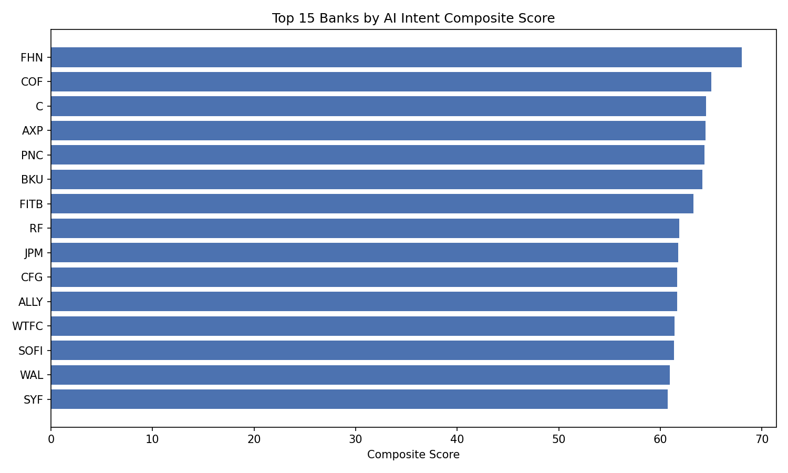
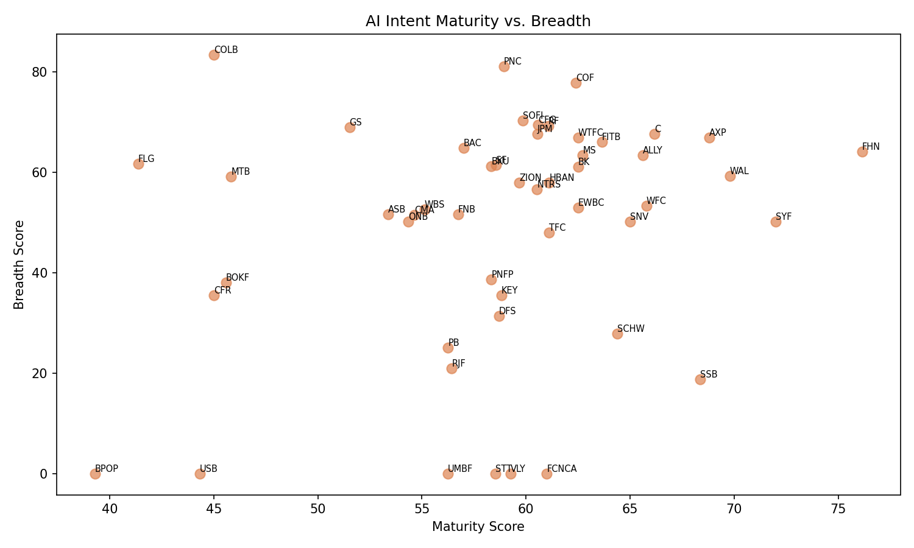
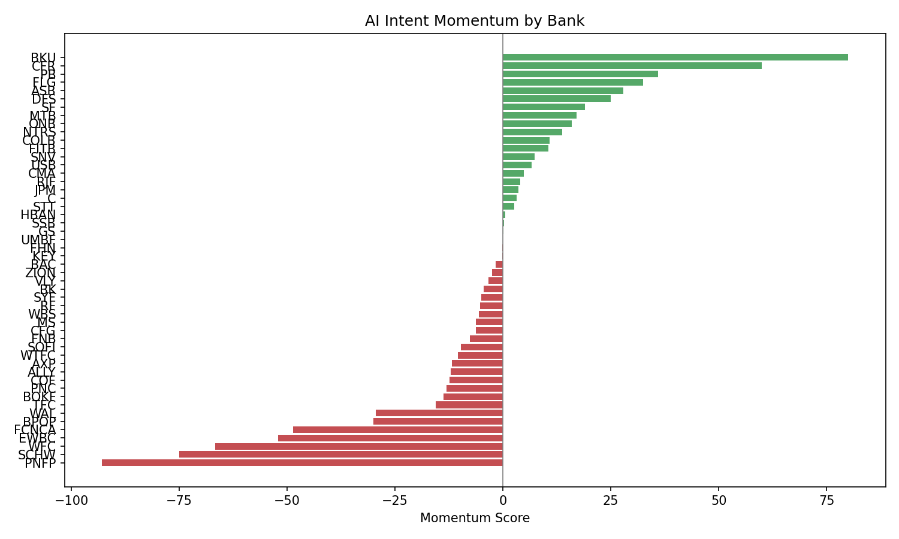
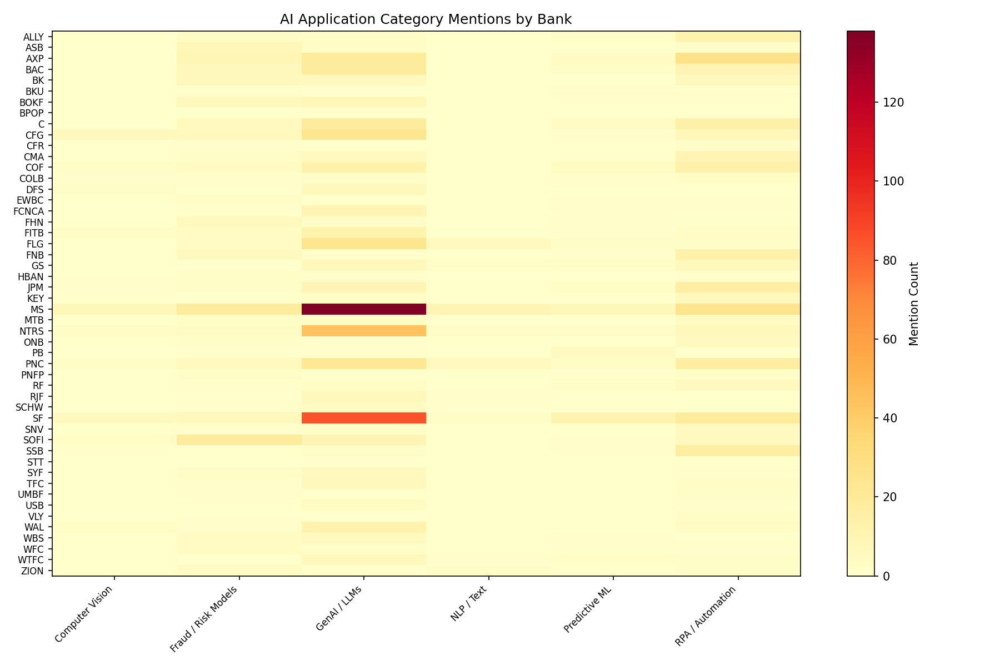

# AI Intent Classification Report

## 1. Executive Summary

This report analyzes AI intent classification across **50 banks**.

**Average maturity score:** 58.63 (scale 1–4)

### Top 5 Banks by Composite Score

| Rank | Ticker | Bank | Composite | Maturity | Breadth | Momentum |
|------|--------|------|-----------|----------|---------|----------|
| 1 | FHN | First Horizon Corp | 68.000 | 76.14 | 64.13 | -0.17 |
| 2 | COF | Capital One Financial Corp | 65.000 | 62.39 | 77.81 | -12.42 |
| 3 | C | Citigroup Inc | 64.490 | 66.16 | 67.64 | 3.19 |
| 4 | AXP | American Express Co | 64.430 | 68.80 | 66.91 | -11.88 |
| 5 | PNC | Pnc Financial Services Group, Inc. | 64.360 | 58.93 | 81.09 | -13.12 |

## 2. Methodology

### Intent Levels
Each AI mention is classified into one of four intent levels: **Exploring** (1), **Committing** (2), **Deploying** (3), **Scaling** (4).

### Application Categories
Mentions are mapped to six application categories: *GenAI / LLMs*, *Predictive ML*, *NLP / Text*, *Computer Vision*, *RPA / Automation*, *Fraud / Risk Models*.

### Scoring Formulas
- **Maturity** — Weighted average of intent levels across all mentions.
- **Breadth** — Number of distinct application categories with at least one mention.
- **Momentum** — Change in maturity score between the first and last observed quarters.
- **Composite** — Normalized weighted combination of Maturity, Breadth, and Momentum.

## 3. Full Rankings

| Rank | Ticker | Bank | Composite | Maturity | Breadth | Momentum |
|------|--------|------|-----------|----------|---------|----------|
| 1 | FHN | First Horizon Corp | 68.000 | 76.14 | 64.13 | -0.17 |
| 2 | COF | Capital One Financial Corp | 65.000 | 62.39 | 77.81 | -12.42 |
| 3 | C | Citigroup Inc | 64.490 | 66.16 | 67.64 | 3.19 |
| 4 | AXP | American Express Co | 64.430 | 68.80 | 66.91 | -11.88 |
| 5 | PNC | Pnc Financial Services Group, Inc. | 64.360 | 58.93 | 81.09 | -13.12 |
| 6 | BKU | BankUnited, Inc. | 64.130 | 58.33 | 61.31 | 80.00 |
| 7 | FITB | Fifth Third Bancorp | 63.230 | 63.64 | 66.08 | 10.49 |
| 8 | RF | Regions Financial Corp | 61.870 | 61.07 | 69.24 | -5.32 |
| 9 | JPM | Jpmorgan Chase & Co | 61.750 | 60.54 | 67.73 | 3.66 |
| 10 | CFG | Citizens Financial Group Inc/Ri | 61.650 | 60.59 | 69.51 | -6.30 |
| 11 | ALLY | Ally Financial Inc. | 61.630 | 65.62 | 63.49 | -12.06 |
| 12 | WTFC | Wintrust Financial Corp | 61.390 | 62.50 | 66.91 | -10.42 |
| 13 | SOFI | SoFi Technologies, Inc. | 61.330 | 59.85 | 70.37 | -9.70 |
| 14 | WAL | Western Alliance Bancorporation | 60.950 | 69.79 | 59.31 | -29.44 |
| 15 | SYF | Synchrony Financial | 60.710 | 72.00 | 50.24 | -5.00 |
| 16 | MS | Morgan Stanley | 60.580 | 62.72 | 63.39 | -6.27 |
| 17 | COLB | Columbia Banking System, Inc. | 60.000 | 45.00 | 83.39 | 10.83 |
| 18 | BK | Bank of New York Mellon Corp | 59.810 | 62.50 | 61.12 | -4.45 |
| 19 | SF | Stifel Financial Corp | 59.710 | 58.57 | 61.45 | 18.94 |
| 20 | NTRS | Northern Trust Corp | 58.610 | 60.53 | 56.63 | 13.70 |
| 21 | BAC | Bank Of America Corp | 58.570 | 57.01 | 64.83 | -1.71 |
| 22 | HBAN | Huntington Bancshares Inc | 58.400 | 61.11 | 58.03 | 0.48 |
| 23 | SNV | Synovus Financial Corp | 58.130 | 65.00 | 50.24 | 7.29 |
| 24 | ZION | Zions Bancorporation, National Association | 57.460 | 59.68 | 58.03 | -2.55 |
| 25 | GS | Goldman Sachs Group Inc | 57.420 | 51.52 | 69.01 | 0.08 |
| 26 | ASB | Associated Banc-Corp | 54.350 | 53.38 | 51.63 | 27.86 |
| 27 | WFC | Wells Fargo & Company/Mn | 54.060 | 65.79 | 53.34 | -66.67 |
| 28 | TFC | Truist Financial Corp | 53.680 | 61.11 | 48.00 | -15.63 |
| 29 | ONB | Old National Bancorp | 53.460 | 54.35 | 50.24 | 16.00 |
| 30 | EWBC | East West Bancorp Inc | 53.400 | 62.50 | 53.04 | -52.14 |
| 31 | FNB | Fnb Corp | 53.380 | 56.73 | 51.69 | -7.63 |
| 32 | CMA | Comerica Inc | 53.240 | 54.65 | 51.56 | 4.89 |
| 33 | WBS | Webster Financial Corp | 53.080 | 55.13 | 52.65 | -5.52 |
| 34 | MTB | M&T Bank Corp | 52.420 | 45.83 | 59.21 | 17.11 |
| 35 | FLG | Flagstar Financial, Inc. | 52.240 | 41.36 | 61.79 | 32.43 |
| 36 | DFS | Discover Financial Services | 49.710 | 58.70 | 31.38 | 25.00 |
| 37 | KEY | Keycorp | 49.330 | 58.82 | 35.52 | -0.22 |
| 38 | SSB | SouthState Bank Corp | 48.280 | 68.38 | 18.78 | 0.21 |
| 39 | PB | Prosperity Bancshares Inc | 47.130 | 56.25 | 25.15 | 36.00 |
| 40 | CFR | Cullen/Frost Bankers, Inc. | 46.930 | 45.00 | 35.52 | 60.00 |
| 41 | SCHW | Schwab Charles Corp | 43.840 | 64.38 | 27.93 | -75.00 |
| 42 | RJF | Raymond James Financial Inc | 43.370 | 56.43 | 21.03 | 4.00 |
| 43 | PNFP | Pinnacle Financial Partners Inc | 43.240 | 58.33 | 38.69 | -92.86 |
| 44 | BOKF | Bok Financial Corp | 42.600 | 45.59 | 38.11 | -13.71 |
| 45 | STT | State Street Corp | 36.970 | 58.54 | 0.00 | 2.67 |
| 46 | VLY | Valley National Bancorp | 36.880 | 59.26 | -0.00 | -3.37 |
| 47 | UMBF | Umb Financial Corp | 35.620 | 56.25 | -0.00 | 0.00 |
| 48 | FCNCA | First Citizens Bancshares Inc | 34.360 | 61.00 | -0.00 | -48.57 |
| 49 | USB | Us Bancorp \De\ | 30.160 | 44.32 | -0.00 | 6.67 |
| 50 | BPOP | Popular, Inc. | 24.890 | 39.29 | -0.00 | -30.00 |

## 4. Key Visualizations

### Composite Score Rankings

### Maturity vs. Breadth

### Momentum Scores

### Application Category Heatmap

## 5. Bank Highlights

### First Horizon Corp (FHN)

- **Rank:** 1  |  **Composite:** 68.000  |  **Maturity:** 76.14  |  **Breadth:** 64.13  |  **Momentum:** -0.17
- Negative momentum suggests a plateau or pull-back in AI initiatives.

### Capital One Financial Corp (COF)

- **Rank:** 2  |  **Composite:** 65.000  |  **Maturity:** 62.39  |  **Breadth:** 77.81  |  **Momentum:** -12.42
- Negative momentum suggests a plateau or pull-back in AI initiatives.

### Citigroup Inc (C)

- **Rank:** 3  |  **Composite:** 64.490  |  **Maturity:** 66.16  |  **Breadth:** 67.64  |  **Momentum:** 3.19
- Positive momentum indicates increasing AI commitment over recent quarters.

## 6. Trends & Momentum

- **Highest momentum:** BKU (80.00)
- **Lowest momentum:** PNFP (-92.86)

### Average Maturity by Quarter

| Year | Quarter | Avg Maturity |
|------|---------|-------------|
| 2023 | Q2 | 87.50 |
| 2023 | Q3 | 77.50 |
| 2023 | Q4 | 62.01 |
| 2024 | Q1 | 63.04 |
| 2024 | Q2 | 57.77 |
| 2024 | Q3 | 56.10 |
| 2024 | Q4 | 61.92 |
| 2025 | Q1 | 60.97 |
| 2025 | Q2 | 55.11 |
| 2025 | Q3 | 64.05 |
| 2025 | Q4 | 54.64 |
| 2026 | Q1 | 72.22 |
| 2026 | Q2 | 50.00 |

Average *Scaling* percentage decreased from 50.0% to 0.0% over the observation window.
